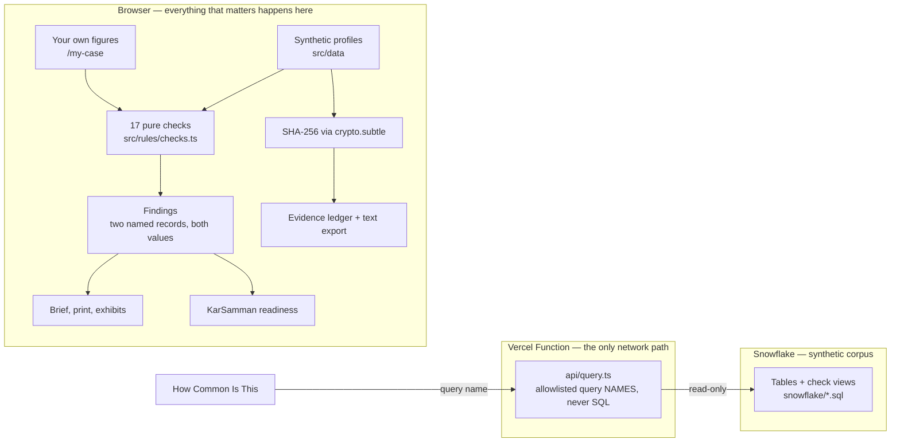

<div align="center">

# Sakshya — साक्ष्य

**The taxpayer's side of the evidentiary record, for Income Tax e-Filing.**

[](LICENSE)
[](https://react.dev)
[](https://www.typescriptlang.org)
[](https://vite.dev)
[](#testing)

[Live demo](https://sakshya-for-my-tax.vercel.app) · [Submission](SUBMISSION.md) · [Constraints](AGENTS.md)

</div>

> [!IMPORTANT]
> **An independent hackathon prototype. Not a Government of India service, and not affiliated with or endorsed by the Income Tax Department.** Every taxpayer profile, identifier, amount and credential in this repository is fictional. It connects to no government system.

---

## Contents

- [The problem](#the-problem)
- [What it does](#what-it-does)
- [Tech stack](#tech-stack)
- [Architecture](#architecture)
- [Getting started](#getting-started)
- [Scripts](#scripts)
- [Configuration](#configuration)
- [Project structure](#project-structure)
- [Testing](#testing)
- [Deployment](#deployment)
- [Security](#security)
- [Accessibility and performance](#accessibility-and-performance)
- [The checks](#the-checks)
- [Profiles](#profiles)
- [Contributing](#contributing)
- [What it is not](#what-it-is-not)
- [Disclosure](#disclosure)
- [Licence](#licence)

---

## The problem

When an automated system and your own paperwork disagree, the system issues a demand — not an apology. The burden of proof lands on you.

India's Income Tax e-Filing portal has roughly 14 crore registered accounts, and returns are assessed by automated rule engines. The recurring failures documented in the research corpus all share one shape:

| What happens | The disagreement |
| --- | --- |
| A challan paid before the deadline doesn't reach the taxes-paid schedule | Your receipt says paid; the return says nothing |
| A rebate accepted in the preparation utility is disallowed at processing | Two engines disagree |
| Employer contribution claimed above the Form 16 stated cap | Return says 14%; Form 16 says 10% |
| The same interest entry appears twice in the AIS | AIS says two; the payer certificate says one |
| A return is submitted but never e-verified | Submitted date recorded; verification date absent |
| Advance tax in Form 26AS never pre-fills into the return | Statement says paid; schedule says nothing |

In each case the citizen holds the contradicting record and has no way to **assemble, timestamp, or present** it. That is the gap Sakshya fills.

## What it does

| | |
| --- | --- |
| **Reconcile** | 17 deterministic checks run over a taxpayer profile, each reporting an objective difference between two named records with both values side by side. |
| **Use your own figures** | The same 17 checks run against numbers you type at `/my-case`. Nothing is uploaded, nothing is stored, refreshing clears it. |
| **Act** | Every finding names the correction route, who has to act (you, your deductor, or the Department), and the official service that route goes through. |
| **Track the clock** | Filing due date, the 30-day e-verification window, notice response dates — each shown as plain time remaining. |
| **Score your readiness** | KarSamman (कर सम्मान) scores out of 1000 how much of your own evidence is assembled, read from the same 17 checks so it can never disagree with the brief. |
| **Prove** | Every record is fingerprinted with SHA-256 in the browser via `crypto.subtle`, and the ledger downloads as text carrying the exact string each digest was taken over. |
| **Contest** | Copy-ready text for a grievance, for AIS feedback, or for your deductor — plus a print stylesheet producing one carryable page. |
| **Learn the interface** | A 16-step guided walkthrough spotlights each real control in place, with arrow-key and Escape handling. |

## Tech stack

Everything below is a direct dependency, at the version this build runs on.

### Application

| Technology | Version | Why it is here |
| --- | --- | --- |
| [React](https://react.dev) | 19 | UI. The whole brief is derived state over a profile, which is what React is good at. |
| [TypeScript](https://www.typescriptlang.org) | 6 (strict) | The domain is money and dates; the compiler catches the unit mistakes that a tax tool cannot afford. |
| [React Router](https://reactrouter.com) | 7 | Client routing across the six surfaces, so the guided walkthrough can drive the app itself. |
| [lucide-react](https://lucide.dev) | 1.x | Inline SVG icons — no icon font, no bitmap, tree-shaken. |
| [Web Crypto API](https://developer.mozilla.org/docs/Web/API/SubtleCrypto) | platform | `crypto.subtle.digest` for SHA-256 fingerprints. Native, so no hashing library ships. |
| Plain CSS with custom properties | — | One token set drives the whole theme. No CSS framework, no runtime style engine. |

### Build and quality

| Technology | Version | Why it is here |
| --- | --- | --- |
| [Vite](https://vite.dev) | 8 | Dev server and production build. |
| [Vitest](https://vitest.dev) | 4 | 137 tests over the pure rule functions; shares the Vite transform pipeline. |
| [ESLint](https://eslint.org) + [typescript-eslint](https://typescript-eslint.io) | 10 / 8 | A green build does not prove correctness — lint catches the referenced-but-undefined symbol that bundling happily ignores. |
| `eslint-plugin-react-hooks`, `eslint-plugin-react-refresh` | — | Hook rules and fast-refresh boundaries. |

### Data and hosting

| Technology | Why it is here |
| --- | --- |
| [Vercel](https://vercel.com) static hosting | Ships the SPA. The brief needs no server to be correct. |
| [Vercel Functions](https://vercel.com/docs/functions) (Node) | One endpoint, `api/query.ts`, holds the warehouse credentials so the browser never sees them. |
| [Snowflake](https://www.snowflake.com) + `snowflake-sdk` | Holds the same synthetic corpus at a scale a browser cannot hold, for the "How Common Is This" prevalence view. |

No state manager, no component library, no CSS framework, no date library, no hashing library, and no AI SDK in the correctness path — each was considered and left out because a platform feature already covered it.

## Architecture



Three properties this shape buys:

1. **The correctness path never leaves the device.** Checks and hashes are pure functions over local data, so the brief is reproducible and works offline after first load.
2. **No credential can leak through the bundle.** Warehouse secrets exist only in Vercel environment variables read by the function — never in a `VITE_*` variable, which Vite would inline into shipped JavaScript.
3. **No model sits between a document and a finding.** The assist panel drafts wording only, and is labelled a mock-up in the UI.

## Getting started

### Prerequisites

- **Node.js 20.19+ or 22.12+** (developed on 24.14). Vite 8 requires one of these.
- **npm 10+** (developed on 11.9).
- A Snowflake account is **optional** — needed only for the "How Common Is This" tab. Every other surface runs with no backend at all.

### Install and run

```powershell
git clone https://github.com/mahanteshimath/Build-What-Moves-India.git
cd Build-What-Moves-India
npm install
npm run dev
```

Open the printed URL. The app lands on **Start Here** and offers the guided walkthrough.

**Demo sign-in:** `demo` / `sakshya-demo` — also `asha` or `ravi`, same password. These are fictional, ship inside the bundle, and protect nothing; the gate exists so the walkthrough has a beginning.

## Scripts

| Command | What it does |
| --- | --- |
| `npm run dev` | Vite dev server on port 3000, bound to `0.0.0.0` so a phone on the same network can open it. |
| `npm run build` | `tsc -b` project references, then a production bundle into `dist/`. |
| `npm run preview` | Serves the built `dist/` for a final check. |
| `npm run test` | The full Vitest suite, once. |
| `npm run lint` | ESLint across the repository. |

Run one test file while iterating:

```powershell
npx vitest run src/rules/checks.test.ts
```

## Configuration

Only the warehouse tab needs configuration. Copy the template and fill it in:

```powershell
Copy-Item .env.example .env.local
```

| Variable | Purpose |
| --- | --- |
| `SNOWFLAKE_ACCOUNT` | Bare account identifier, e.g. `ab12345.ap-south-1`. Pasting a console URL fails as `ERR_SF_RESPONSE_FAILURE (401002)`. |
| `SNOWFLAKE_USER` | Read-only user. |
| `SNOWFLAKE_PASSWORD` | Its password. |
| `SNOWFLAKE_ROLE` | A role with `SELECT` only — see `snowflake/06_grants.sql`. |
| `SNOWFLAKE_DATABASE` | Database holding the synthetic corpus. |
| `SNOWFLAKE_SCHEMA` | Schema, `SCH` in the shipped SQL. |
| `SNOWFLAKE_WAREHOUSE` | Compute warehouse for the read. |

> [!WARNING]
> These are **server-only**. Never prefix any of them with `VITE_` — Vite inlines `VITE_*` values into the client bundle, which would publish the credential to every visitor.

To build the warehouse from scratch, run `snowflake/01_schema.sql` through `06_grants.sql` in order.

## Project structure

```
api/query.ts            The only server code: allowlisted query names → Snowflake
snowflake/*.sql         Schema, seed, check views, exports, analytics, least-privilege grants
src/
  domain/tax.ts         Contracts: TaxProfile, Finding, Remedy, money in integer paise
  rules/                Pure logic, each file with a sibling *.test.ts
    checks.ts           The 17 deterministic checks
    clocks.ts           Statutory windows in days remaining
    exhibits.ts         Grievance / AIS feedback / deductor text
    ledger.ts           The re-hashable evidence ledger export
    ownCase.ts          Hand-entered figures → a TaxProfile
    readiness.ts        KarSamman score, derived from the same findings
    simulate.ts         What-if levers: carried / cleared / raised
  data/                 Synthetic profiles, documented portal issues, verified official URLs
  components/           Guided tour, exhibit panel, clock strip, ledger download, assist panel
  pages/                Start Here, Portal Issues, Brief, Your Own Figures, Readiness, Explorer
  ai/mockNova.ts        Local templates behind a model-shaped seam. Calls nothing.
Deep Research On ALL Web Sites/   Research corpus. Input only — never application data.
```

## Testing

```powershell
npm run test
```

137 tests across 10 files. The suite is deliberately weighted toward the rules, because they are the only thing a citizen would quote at a counter:

- **Positive cases** — each check fires on the record shape it describes.
- **Silence cases** — a reconciled profile produces no findings. A tool that manufactures problems is worse than no tool.
- **Boundary cases** — thresholds, the e-verification window, due-date edges, IST day boundaries.
- **Contract tests** — every finding carries a remedy naming who must act, and every URL a remedy cites is one of the verified sources in `src/data/sources.ts`. Cite an unlisted URL and the suite fails.
- **Placement tests** — the guided walkthrough card stays inside the viewport beside targets taller than the screen.

## Deployment

The app is a static bundle plus one function, so any host that runs both will serve it. On Vercel:

```powershell
npx vercel --prod
```

Set the seven Snowflake variables in **Project → Settings → Environment Variables** (production scope) before the warehouse tab will answer. Everything else works without them.

Verify a deployment by the artefact, not the console output — fetch the live page, read the hashed asset name it references, and confirm it matches your local `dist/assets`.

## Security

- **The demo sign-in is not authentication.** Three fictional accounts live in the client bundle. Nothing sensitive sits behind them, and nothing should.
- **`api/query.ts` is unauthenticated in practice**, so it accepts a **query name from a fixed allowlist and never SQL**. Table and view identifiers are checked against known sets before interpolation, because Snowflake cannot bind identifiers as parameters.
- **Credentials live only in environment variables** read server-side. `.env*` is gitignored; only `.env.example` is tracked.
- **The database role should hold `SELECT` and nothing else** — `snowflake/06_grants.sql` is written that way.
- **No user data crosses the network.** Figures typed into Your Own Figures stay in the tab and are gone on refresh.

Found a security problem? Open an issue **without** a working exploit payload, or contact the maintainer directly.

## Accessibility and performance

Measured, not asserted:

- **~129 KB gzipped JavaScript, ~10 KB CSS.** No web fonts, no bitmap images, icons inline.
- **Zero horizontal overflow on all six routes at a 400px viewport.** The tab bar scrolls rather than breaking apart.
- **Works offline after first load.** Only the warehouse tab makes a request, and the page says so.
- Skip-to-content is the first tab stop; status is carried in words as well as colour; every control has a text label; the walkthrough is a focused dialog with keyboard control; `prefers-reduced-motion` is respected.

## The checks

| Check | Reports |
| --- | --- |
| `challanCredit` | A challan CIN absent from, or differing in amount from, the taxes-paid schedule |
| `deadlineGap` | Payment timestamp before the due date with a submission timestamp after it |
| `rebateOnSpecialRate` | A rebate claimed alongside income taxed at special rates |
| `tdsMatch` | Form 16 TDS against Form 26AS TDS |
| `claimedTds` | TDS claimed in the return against Form 26AS |
| `unreflectedTdsQuarter` | A quarter present in Form 16 but absent from Form 26AS |
| `npsCap` | Employer contribution claimed above the Form 16 stated cap |
| `aisDuplicates` | AIS entries repeating payer, amount and date |
| `interestDeclared` | Declared interest against the AIS total |
| `everification` | A submitted return with no verification date recorded |
| `bankAccountReadiness` | A refund claim with no validated refund bank account on record |
| `panAadhaarOperative` | An inoperative PAN against a return claiming credit |
| `demandOffsetLedger` | A demand offset with no assessment order on record |
| `refundBand` | A refund above the documented review band |
| `noticeEvidence` | Documents a notice names that are not on record |
| `verificationBeforeFiling` | A verification date earlier than the submission date |
| `creditPaidAfterFiling` | A claimed challan the receipt dates after submission |

Every check is a pure function in [src/rules/checks.ts](src/rules/checks.ts), tested in [src/rules/checks.test.ts](src/rules/checks.test.ts). No model sits in the correctness path.

## Profiles

Nine synthetic taxpayers, one per issue category: `deadline-payment`, `rebate-capital-gains`, `ais-duplicate`, `unreflected-tds-q4`, `bank-preval-stalled`, `pan-inoperative-234h`, `notice-response`, `refund-review`, and `clean-filing` — which reconciles fully and returns a ready state.

The research records two statutory due dates for AY 2026-27: 31 July for salaried and other non-audit filers, and 31 August for non-audit business and professional filers. `refund-review` files against the later one.

## Contributing

Issues and pull requests are welcome. Before opening a PR:

```powershell
npm run test
npm run lint
npm run build
```

House rules, in full in [AGENTS.md](AGENTS.md):

- **Keep the rules pure.** Business logic under `src/rules/` must be deterministic, and every non-trivial rule ships with a test.
- **A finding states an objective difference between two named records.** Safe: "Form 16 shows X, Form 26AS shows Y." Not acceptable: predicting a penalty, a refund, or why a portal behaved as it did.
- **Money is integer paise**, formatted only at the edge with `Intl.NumberFormat`.
- **Official URLs live only in `src/data/sources.ts`**, and only if verified reachable.
- **Never add** portal login, scraping, OTP handling, government API calls, auto-filing, grievance submission, or real document uploads.
- **Never introduce a `VITE_*` secret.** Vite inlines those into the bundle.
- Prefer a platform feature to a dependency, and the smallest change that actually fixes the cause.

## What it is not

No portal login, scraping, OTP handling, government API calls, auto-filing, grievance submission, document persistence, or real document uploads. It states no tax or legal outcome, predicts no approval or refund, and makes no claim about why a portal behaved as it did — only that two named records differ.

Amounts documented from the local research report are labelled research signals, not official facts. Official links are limited to URLs verified reachable, held in [src/data/sources.ts](src/data/sources.ts).

All data is synthetic.

## Disclosure

**Independence.** Sakshya is an independent build for a hackathon. Public documentation and public reporting about the e-Filing portal were read to understand the problem; no portal code was copied, no portal infrastructure was used, and no private system was reverse-engineered.

**No live government system.** There is no portal login, scraping, OTP handling, government API call, auto-filing, or grievance submission. Every record is a simulated integration over synthetic data.

**No real data.** All nine taxpayer profiles, PANs, challan identifiers, notices and amounts are fictional. The demo sign-in credentials are fictional. No real identifier, password, OTP or payment detail appears anywhere in the repository.

**No official branding.** No government emblem, seal or departmental logo is used. The header states on every page that this is an independent prototype.

**How Codex contributed.** Codex was the primary development tool for this build:

- Read the deep-research corpus in `Deep Research On ALL Web Sites/` and derived the recurring failure shapes that became the profiles.
- Designed the domain contracts in `src/domain/tax.ts` and the seventeen pure checks in `src/rules/checks.ts`.
- Wrote the test suite, including the silence and boundary cases.
- Built the React surfaces, the SHA-256 evidence ledger, the guided walkthrough, and the print stylesheet.
- Wrote `snowflake/*.sql` and the allowlist-only `api/query.ts` endpoint.
- Ran the safety review that produced the constraints in [AGENTS.md](AGENTS.md) — no legal or tax outcomes, no portal-cause claims, findings limited to objective differences between two named records.

**Third-party components**, all under permissive licences:

| Component | Licence |
| --- | --- |
| React, React DOM, React Router | MIT |
| Vite, `@vitejs/plugin-react` | MIT |
| TypeScript | Apache-2.0 |
| Vitest | MIT |
| ESLint, `typescript-eslint` | MIT |
| `lucide-react` | ISC |
| `snowflake-sdk` | Apache-2.0 |

Scaffolded from the standard `npm create vite` React + TypeScript template.

**Network behaviour.** The brief, the checks and the fingerprints are computed entirely in the browser. The Data Explorer tab is the only network path: it posts a query *name* from a fixed allowlist to `/api/query`, which runs a read-only statement against a Snowflake warehouse holding the same synthetic records. No SQL crosses the wire and no credential is present in the bundle.

## Licence

[MIT](LICENSE). The synthetic data is fictional and free to reuse; the research corpus under `Deep Research On ALL Web Sites/` is reference material, not part of the licensed source.
